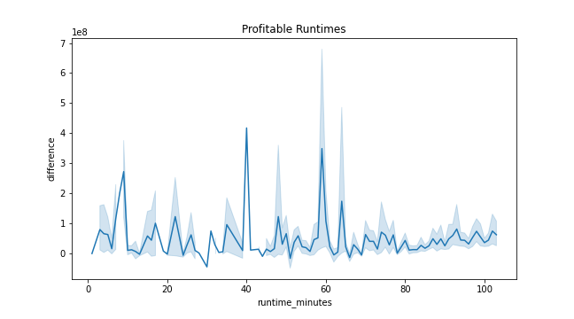
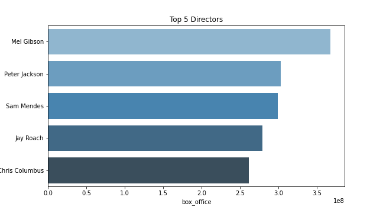
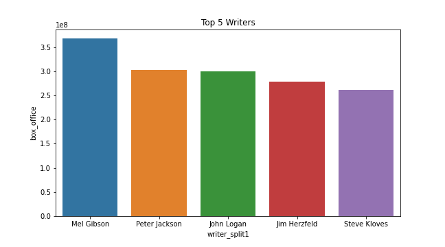

# Project Description:

Analyzing movie data to come up with recommendations for Microsoft's new movie studio

## Data 

Movie datasets from:

1. Box Office Mojo
2. IMDB
3. Rotten Tomatoes
4. TheMovieDB.org

## Key Findings

### Is there a relation between the runtime for a movie and profit?

I looked into (movie_budgets) file and it has a column for a (production budget) and 
column for (worldwide gross), from the data in the 2 column we were able to find 
out if the movies made profit or not.The data need some cleaning, first we worked on cleaning the data type from object to int64, second we cleaned the missing values.Then I merged it with (title basics) which has the runtime column and cleaned the data some more.

Here are our key findings:

1. There is a relation between the runtime and how profitable the movie is.
2. The best runtime is around a hour.
3. But anything over an hour and twenty minutes does not do good. 



**recommendations**

1. If you are looking to make profitable movies conceder making the runtime around 
   the hour mark.
2. if you had to go over an hour, i would recommend keeping it under the hour and 
   fifteen minute mark.

### Who are the Top 5 Directors to work with?

I looked into (movie_info) file and it has a column for a (Director) and  
column for (box_office), from the data in the 2 column we were able to find 
out the relationship between the movies that did well at the box office and 
the directors who worked on them. The data need some cleaning, first we worked 
on cleaning the data type from object to int64 for the (box_office) column, 
second we cleaned the missing values.

Here are our findings:
    
1. We were able to determine the best top five directors.
2. The top 5 directors are: 1.Mel Gibson 2. Peter Jackson 3. Sam Mendes 4. Jay Roach 5. Chris Columbus




**Recommendation**

. If you were looking into making movies that do well at the Box office I would recommend you 
   use one of the top 5 directors to direct your movies.
   
. Based on the correlation between writer and director, we suggest that the main writer and director be the same person

### Who are the Top 5 Writers to work with?

I looked into (movie_info) file and it has a column for a (Writer) and  
column for (box_office), from the data in the 2 columns we were able to find 
out the relationship between the movies that did well at the box office and 
the Writers who worked on them. The data need some cleaning, so first we worked 
on cleaning the Writer column because some of the values had 2 names on them
at a time. We separated the names and got rid of the repeated values. Second we cleaned the missing values.

Here are our findings:

. The top 5 writers to work with are :

1. Mel Gibson 2. Peter Jackson 3. John Logan 4. Jim Herzfeld 5. Steve Kloves



***Recommendation***

. Consider those writers to work on your movies, the movies they worked on did well at the box office.

# Command to convert jupyter notebook to markdown file

# jupyter nbconvert --to markdown notebookname.ipynb


```python

```
